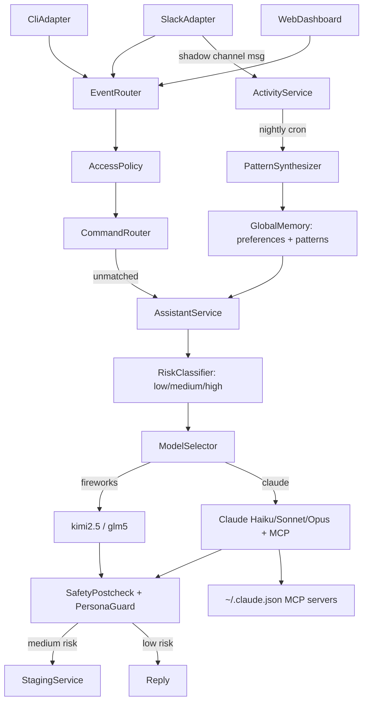

# Robin — Architecture

## Purpose

Robin is a single assistant core reachable through Slack, CLI, and a web dashboard simultaneously. All channels share one assistant identity, one durable SQLite store, and one todo ledger. Conversation-level context is partitioned by channel+thread.

---

## Product Principles

- One assistant core, many ingestion channels
- OWNER-first access policy by default
- Multi-model orchestration: fast open-source models for simple tasks, Claude for tools and MCP
- Passive shadowing — Robin watches configured Slack channels silently; nightly pattern synthesis
- Risk-gated execution — task risk classified (low/medium/high); tool allowlists selected per risk level
- Safety gates fail closed — deny on error, never silent pass-through
- No self-mutation — Robin cannot modify its own code or config

---

## Data flow

---

## Component responsibilities

### Ingress Layer
- Transport-specific decoding only (Slack event, CLI readline, HTTP)
- Emits normalized `IngressEvent` — never calls LLM directly
- Shadow path: owner channel messages in `shadowChannels` emit `source: 'slack_shadow'`, bypassing all routing, recorded to `ActivityService`
- Thread context: on @mention in a thread, fetches `conversations.replies` (including bot messages) and attaches as `metadata.threadMessages`
- Thread continuation: if `session.agentSessionId` exists for a thread, subsequent messages reach Robin without @mention

### Access Policy Layer
- OWNER-first: owner and CLI/system sources always pass
- Configurable at runtime via `policy set` commands
- All denials emit structured `access.denied` audit events

### Command Router
- Regex-matched deterministic commands — no LLM call
- Todo executor: LLM responses containing `add todo:` / `mark done:` etc. auto-executed on CLI source
- Feature pipelines: todos, mentions, alerts, comms, MCP, staging, mode, policy

### Model Selector
- Classifies text + thread context for routing signals
- MCP/alert keywords → Claude Sonnet (open-source models cannot use MCP)
- Tool keywords → Claude Haiku
- Deep analysis without tools → glm5 (Fireworks)
- Todo / well-defined → kimi2.5 (Fireworks)
- User override: `use kimi:`, `use opus:`, etc. in prompt

### Assistant Service
- Builds `PromptEnvelope`: persona + global patterns + conversation memory + thread context + todo context + risk-based tools
- Safety precheck: blocks secrets in input, forbidden tools, oversized input
- Emits `runner_start` to ActivityBus (spinner starts in CLI)
- Runs LLM via `AgentSdkRunnerClient` or `FireworksRunnerClient`
- Safety postcheck + persona guard before publishing

### Memory Layer
- Conversation-scoped: per thread, 30-day retention
- Global-scoped: owner preferences and behavioral patterns from pattern synthesis
- Global patterns injected as `[owner context]` into every prompt envelope

### MCP Integration
- `~/.claude.json` servers loaded at startup — tokens managed by Claude Code, never copied
- Stdio and HTTP servers supported; only Claude path uses MCP (Fireworks has no MCP access)
- Robin-managed registry (`mcp add/validate/test/enable`) for additional HTTP endpoints

### Risk Gate
- `low`: read-only tools only
- `medium`: read-only tools; response staged for approval if `StagingService` active
- `high`: empty tool list — LLM cannot execute any tool

### ActivityBus (CLI display)
- Global no-op event bus; no-op in Slack-only mode and tests
- CLI renderer subscribes: spinner, tool call stream, ingress badges, model label

---

## Security model

- Secrets never stored in source or config — env injection only
- `~/.claude.json` tokens passed through to SDK at runtime; not persisted by Robin
- Audit trail for: policy denials, mode changes, MCP actions, runner telemetry
- Audit schema: `event_type`, `actor_id`, `timestamp`, `correlation_id`, `outcome`
- Secrets and full prompt bodies never logged
