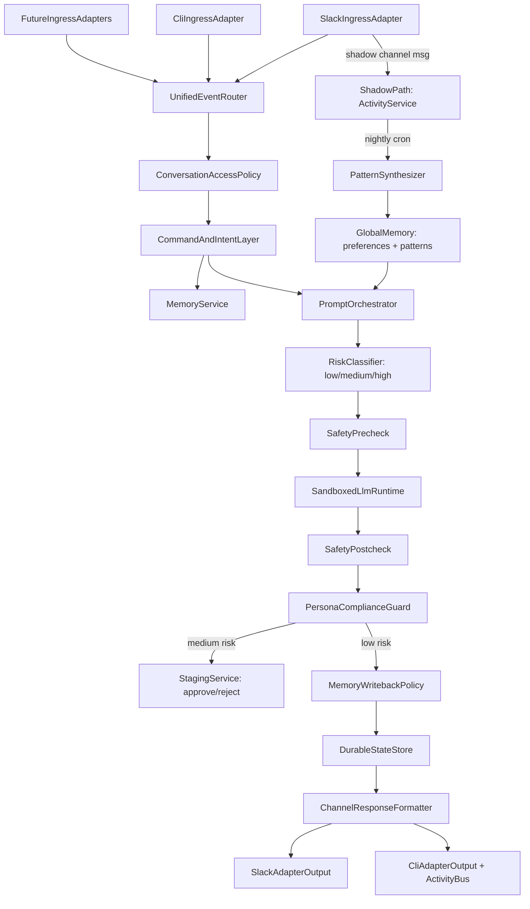

# Robin Architecture (Human-Facing)

## Purpose

Robin is a single assistant core that can be reached through multiple channels (Slack, CLI, and future adapters like Telegram/WhatsApp).  
All channels talk to the same assistant identity, shared todo state, and shared long-lived context, while preserving conversation-level context where needed.

This document explains the architecture for humans: what components exist, how data flows, and what safety boundaries are enforced.

## Product Principles

- One assistant core, many ingestion channels.
- OWNER-first access policy by default.
- Draft-only autonomy for sensitive actions.
- No self-mutation (Robin proposes upgrades, never applies them by itself).
- Safety and security checks before and after every LLM interaction.
- LLM/agent execution must run in a sandboxed container component (no direct host access).
- SDK permission mode can be `bypassPermissions`; therefore Robin policy checks are mandatory and cannot be delegated to SDK prompts.
- Passive observation (shadow mode) — Robin watches configured Slack channels silently, recording owner activity without replying.
- Pattern learning — a nightly synthesis loop compresses shadow observations into owner preferences and behavioral patterns stored as global memory.
- Risk-gated execution — task risk is classified (low/medium/high) before each LLM call; tool allowlists are selected per risk level.

## Operating Constraints (Current Direction)

- Primary deployment target: single-user local machine.
- Retention policy: 30 days with auto-prune.
- MVP integration boundary: Slack-first (external incident systems later).
- Conversation policy: OWNER by default; other users only if explicitly enabled.

## High-Level Architecture

## Separation of Concerns

### 1) Ingestion Layer
- Owns transport-specific concerns only (Slack event decoding, CLI input handling, adapter auth handshake).
- Must not call LLM directly.
- Emits normalized assistant events conforming to canonical `IngressEvent` (defined in `IMPLEMENTATION_FOR_AGENTS.md`).

### 2) Access Policy Layer
- Enforces OWNER-first communication policy.
- Handles allowlist checks for users/channels when non-owner access is enabled.
- Emits explicit denied responses and audit events.
- Runs immediately after event normalization and before command routing, memory retrieval, or LLM invocation.

### 3) Command and Intent Layer
- Routes deterministic commands (`todo`, `policy`, `mcp`, `mode`) before LLM usage.
- Classifies non-command input into assistant tasks.

### 4) Memory Layer
- Maintains:
  - shared assistant memory (todos, preferences, decisions),
  - conversation-local memory (thread/session context),
  - audit events and lifecycle state.
- Applies retention and compaction policies.
- Memory writeback occurs only after post-LLM safety/persona checks pass.

### 5) Prompt Orchestration Layer
- Builds prompt envelopes by combining:
  - persona,
  - retrieved memory,
  - task context,
  - policy constraints,
  - allowed tools.
- Encodes explicit response contracts.
- Response contracts define format (`markdown`/`slack_mrkdwn`/`plain`), link policy, and output-size constraints.

### 6) Safety and Persona Guard Layer
- Pre-LLM checks:
  - tool restrictions,
  - sensitive data leakage prevention,
  - action policy validation.
- Post-LLM checks:
  - redaction and sanitization,
  - persona compliance,
  - policy compliance before publishing.
- Failure behavior is fail-closed:
  - pre-LLM failure blocks runner call,
  - post-LLM failure blocks publish and emits safe fallback response.

### 7) LLM Runtime Layer
- Runs in isolated containerized component.
- Receives structured request payloads only.
- Returns structured output + telemetry + tool trace.
- No direct host-level write access.
- Enforced isolation boundaries:
  - controlled read-only mounts by default,
  - restricted network egress allowlist,
  - resource limits (CPU/memory/timeouts),
  - no privileged container mode.

Current-state note: until sandbox runner is fully enabled, execution may still happen in-process. In that period, policy layer enforcement is the primary safety boundary.

### 8) Output Layer
- Formats output for each channel while preserving a common semantic response.
- Publishes drafts only for high-risk operations unless explicit approval command exists.

## Shared vs Local Context

- Shared across channels:
  - todos and statuses,
  - global OWNER preferences,
  - decisions and known constraints.
- Local to a conversation:
  - thread-specific temporary context,
  - intermediate reasoning references,
  - short-lived disambiguation state.

This keeps cross-channel continuity without leaking irrelevant thread history everywhere.
Channel-local context is partitioned by conversation/channel identity; shared state is limited to explicit shared entities (todos/preferences/approved decisions).

## Security Model

- Secrets never hardcoded in source/config docs.
- Secrets injected at runtime via environment or secret providers.
- `robin.json` env blocks must not carry secrets; use secret references and runtime env injection only.
- Secret-like patterns redacted before persistence or outbound channel responses.
- Audit trail for:
  - policy denials,
  - mode switches,
  - MCP onboarding actions,
  - sensitive draft generation events.
Audit records require structured fields (`event_type`, `actor_id`, `timestamp`, `correlation_id`, `outcome`) and must not include raw secrets or full prompt bodies.

## Channel Strategy

- Slack and CLI are simultaneous communication channels to the same Robin core.
- New channels (Telegram/WhatsApp) are added as adapters implementing the same ingress/output contracts.
- Channel onboarding must not require architecture rewrites.

## MCP Strategy

- MCP integrations are owner-invoked and proposal-first.
- Robin supports setup assistant commands (`mcp add/validate/test/enable`) with explicit approval gates.
- MCP connections are disabled by default until validation passes.

## Claude-Direct Mode

- Robin supports:
  - `orchestrated` mode (default),
  - `claude-direct` mode (minimal mediation).
- Even in `claude-direct`, the same pre-LLM and post-LLM safety gates remain mandatory.

## Non-Goals

- Autonomous self-editing/self-deployment.
- Fully automated incident actions without approval.
- Multi-tenant architecture in MVP.

## Evolution Path

Post-MVP extensions:
- external incident systems,
- richer retrieval (semantic index),
- multi-user team mode with strict scoped access controls,
- stronger observability and service deployment profiles.

Architecture remains stable if adapters and policy boundaries are preserved.
